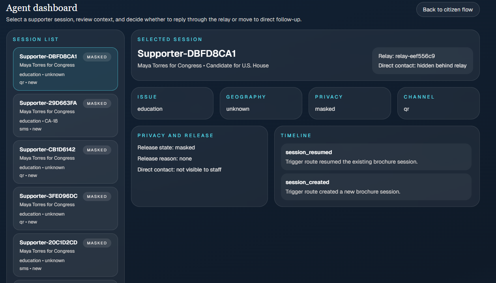
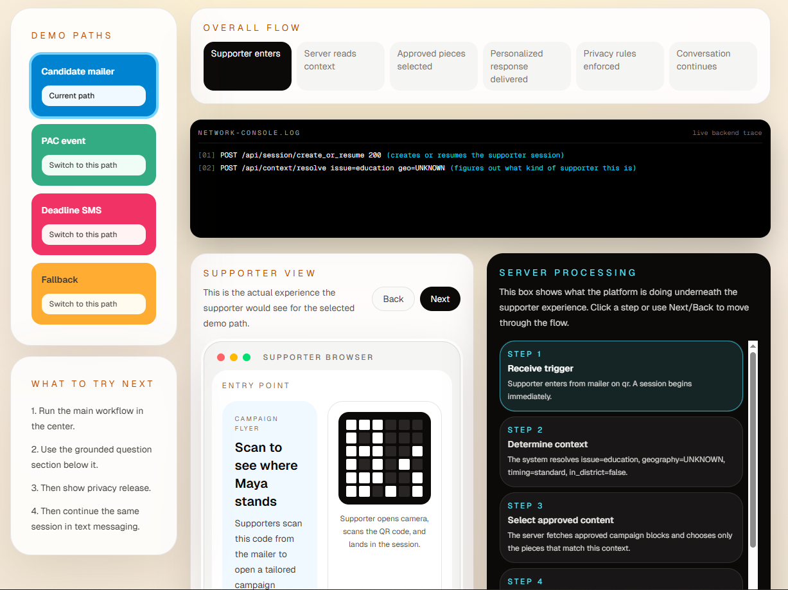

# AI Context- and Privacy-Aware Individualized Outreach

This repository contains a working prototype of the patent I have invented.

It is not a generic campaign microsite. It is a demo implementation of a system that:

- accepts a trigger such as a QR scan, short-code SMS, link, or campaign handoff
- resolves that trigger into an asset-specific persistent session
- assembles approved outreach content based on supporter context
- preserves supporter privacy through a relay layer
- releases direct contact only after verified intent
- keeps the same interaction alive across web and messaging channels

The current prototype is framed as a political fundraising and citizen-engagement product for candidates and PACs.

## Prototype Screens

### Main supporter flow



### Agent dashboard



## Patent Source In This Workspace

The prototype is based on the patent i invented.

This app is intended to make the patent easier to demo to non-technical stakeholders by turning the filing into a live, end-to-end experience.

## What The Prototype Demonstrates

The product flow shown here is built to exercise the core patent ideas:

1. Trigger normalization
   - a supporter starts by scanning a campaign QR code or texting a campaign short code
   - the system turns that trigger into a normalized session entry

2. Persistent session continuity
   - the same supporter session survives page reloads, follow-up actions, and messaging continuation

3. Context-sensitive assembly
   - the system selects only approved content blocks that match the resolved context
   - context includes source, issue interest, geography, timing, and engagement tier

4. Privacy-aware communication
   - the campaign interacts through a relay alias
   - direct supporter contact remains hidden until verified intent

5. Verified-intent release
   - high-intent actions such as donation confirmation, RSVP, or direct opt-in unlock the release state

6. Constrained Q&A
   - the assistant answers only from approved content and known session facts
   - unsupported questions fall back safely

7. Cross-channel continuity
   - the same session continues into a simulated SMS thread without losing context or privacy state

## Demo Experience

The prototype includes two main views:

- `Simple view`
  - designed for campaign operators, investors, and general audiences
  - shows the supporter journey in plain English
  - includes a compact backend traffic console so the demo still feels real

- `Technical view`
  - intended for patent discussion, architecture review, or implementation walkthroughs
  - exposes more of the mechanics behind the same flow

There is also an `Agent dashboard` that shows how campaign staff would see supporter sessions, context, privacy state, and audit history.

## Built Scenarios

The seeded demo includes multiple materially different scenarios:

- Candidate mailer QR trigger
- PAC event link trigger
- Deadline fundraising SMS trigger
- Fallback generic path when context is weak

Each path changes the supporter-facing content, backend resolution logic, and privacy/release behavior.

## Stack

- Next.js
- React
- TypeScript
- Tailwind CSS
- Supabase Postgres
- Vercel deployment target

## Architecture Summary

The app is structured around the domain objects needed to support the patent flow:

- `campaign_assets`
- `trigger_events`
- `outreach_sessions`
- `approved_content_blocks`
- `relay_identities`
- `interaction_logs`
- `verified_intent_events`
- simulated `sms_messages`

This is backed by real Supabase reads and writes for:

- session create/resume
- trigger logging
- content retrieval
- privacy state enforcement
- verified-intent transitions
- interaction audit trail
- simulated SMS continuity

The current SMS transport itself is simulated. It is not yet wired to Twilio.

## Local Setup

1. Install dependencies.

```bash
npm install
```

2. Create `.env.local`.

```bash
NEXT_PUBLIC_SUPABASE_URL=...
NEXT_PUBLIC_SUPABASE_ANON_KEY=...
SUPABASE_SERVICE_ROLE_KEY=...
OPENAI_API_KEY=...
```

3. Apply the database files.

- `supabase/migrations/20260408T160000_init_demo_schema.sql`
- `supabase/seed.sql`

4. Run locally.

```bash
npm run dev
```

Or run the production build locally:

```bash
npm run build
npm run start
```

## Verification

Use the built-in checks:

- `npm run lint`
- `npm run build`
- `npm run verify:supabase`
- `npm run verify:task4`
- `npm run verify:task5`
- `npm run verify:task6`
- `npm run verify:task7`
- `npm run verify:task8`
- `npm run verify:task9`

## Key Routes

- `/`
  - main supporter demo flow

- `/agent`
  - staff-side operator dashboard

- `/api/health/supabase`
  - health verification route

## Recommended Demo Narrative

1. Start on the `Candidate mailer` or `Deadline SMS` scenario.
2. Show the supporter entering through the actual trigger mechanism.
3. Walk through the overall flow and the network console.
4. Show that context is resolved server-side.
5. Show that the supporter receives a tailored response, not generic copy.
6. Demonstrate that privacy stays enforced through the relay.
7. Trigger a verified-intent event and show the release-state change.
8. Continue the same session into SMS.
9. Open the agent dashboard and show the campaign-side view.

## Prototype Boundaries

This repository is intentionally a demo-first implementation.

Current limitations:

- SMS transport is simulated rather than carrier-backed
- direct contact is represented through privacy state and relay identity, not live telecom release
- dashboard authentication is not yet enabled
- constrained Q&A is deterministic and grounded rather than broad open-ended generation

Those constraints are deliberate because the purpose of this repo is to demonstrate the patent mechanics cleanly, not to present a production campaign system.

## Deployment Notes

This app is intended to be deployed on Vercel with Supabase as the backing store.

Recommended deployment assumptions:

- keep the project rooted at `forai-demo/` if deploying from the broader workspace
- configure the same environment variables in Vercel
- never expose `SUPABASE_SERVICE_ROLE_KEY` to the client
- the free tiers of Vercel and Supabase are typically sufficient for low-volume demos

## Why This Repo Exists

Patent documents are hard to demo.

This prototype exists to turn the filing into something a stakeholder can understand immediately:

- how the trigger starts the session
- how context changes the outreach
- how privacy is preserved
- how contact release is policy-gated
- how the experience survives channel changes

That is the core of the invention this repository is trying to make tangible.
